# Public Load Testing Report

Date: 2026-04-09

## Scope

- Runtime: `bun run start`
- Infra: local `postgres` + `redis` via `bun run infra:up`
- Stack under test: `@mist/web`, `@mist/api`, `@mist/worker`
- Route mix:
  - `/` weight `35`
  - `/discover` weight `25`
  - `/api/v1/library` weight `25`
  - `/api/v1/discover/search` weight `15`
- Run profile:
  - 20 seconds per tier
  - concurrency tiers: `10`, `25`, `40`
- Artifacts:
  - `.codex-loadtest/public-mix-baseline.json`
  - `.codex-loadtest/public-mix-after.json`
  - `.codex-loadtest/discover-profile-baseline.json`
  - `.codex-loadtest/discover-profile-after.json`

## Executive Summary

- Redis was previously used well for `session`, `auth challenge`, throttling, and BullMQ, but not as a read cache for the hottest anonymous catalog/discover traffic.
- I added PostgreSQL summary tables for public catalog metrics:
  - `PublicNovelMetric`
  - `PublicAuthorMetric`
- I added worker-driven refresh for those summary tables so expensive engagement aggregates move off the request path.
- I added Redis read-through caching for:
  - `GET /api/v1/discover`
  - `GET /api/v1/library`
  - `GET /api/v1/discover/search`
- I added versioned invalidation for content-changing mutations:
  - novel create/update
  - admin novel visibility changes
- I intentionally did **not** invalidate on every bookmark or reading-progress write. Those counters now refresh on short TTL windows instead of thrashing the cache under real traffic.

## Overall Results

| Concurrency | Before Req/s | After Req/s | Improvement | Before Avg Latency | After Avg Latency | Before p95 | After p95 | Errors |
| --- | ---: | ---: | ---: | ---: | ---: | ---: | ---: | ---: |
| 10 | 19.35 | 58.65 | 3.03x | 396.82 ms | 38.31 ms | 1263.97 ms | 96.61 ms | 0 -> 0 |
| 25 | 24.95 | 142.20 | 5.70x | 893.54 ms | 46.85 ms | 1974.16 ms | 174.61 ms | 0 -> 0 |
| 40 | 28.15 | 182.00 | 6.47x | 1364.17 ms | 92.11 ms | 3163.54 ms | 292.70 ms | 0 -> 0 |

```mermaid
xychart-beta
  title "Browser-like Mix Throughput"
  x-axis ["10", "25", "40"]
  y-axis "Req/s" 0 --> 200
  bar "Before" [19.35, 24.95, 28.15]
  bar "After" [58.65, 142.20, 182.00]
```

```mermaid
xychart-beta
  title "Browser-like Mix p95 Latency"
  x-axis ["10", "25", "40"]
  y-axis "Milliseconds" 0 --> 3300
  bar "Before" [1263.97, 1974.16, 3163.54]
  bar "After" [96.61, 174.61, 292.70]
```

```mermaid
xychart-beta
  title "Error Count"
  x-axis ["10", "25", "40"]
  y-axis "Errors" 0 --> 1
  bar "Before" [0, 0, 0]
  bar "After" [0, 0, 0]
```

## Route Hot Spots

The worst route in the mixed run was still `/discover`, but it improved dramatically after the Redis layer was added.

### At concurrency 40

| Route | Before Avg Latency | After Avg Latency | Improvement |
| --- | ---: | ---: | ---: |
| `/` | 25.97 ms | 37.87 ms | slower but still low |
| `/discover` | 2725.15 ms | 226.75 ms | 12.02x faster |
| `/api/v1/library` | 1401.78 ms | 59.56 ms | 23.54x faster |
| `/api/v1/discover/search` | 2346.19 ms | 59.10 ms | 39.70x faster |

```mermaid
xychart-beta
  title "Route Avg Latency at Concurrency 40"
  x-axis ["/", "/discover", "/api/v1/library", "/api/v1/discover/search"]
  y-axis "Milliseconds" 0 --> 2800
  bar "Before" [25.97, 2725.15, 1401.78, 2346.19]
  bar "After" [37.87, 226.75, 59.56, 59.10]
```

## Discover Profiling

### Before cache

- `service:getDiscoverData`: `82.71 ms`
- `http:api:/api/v1/discover`: `78.31 ms`
- `http:web:/discover`: `99.26 ms`
- SSR/proxy overhead on top of API: about `20.95 ms`

### After cache warm

- `service:getDiscoverData`: `3.04 ms`
- `http:api:/api/v1/discover`: `3.77 ms`
- `http:web:/discover`: `22.88 ms`
- SSR/proxy overhead on top of API: about `19.11 ms`

### What still costs real DB time on a cache miss

The slowest uncached repository calls stayed concentrated in collection previews and aggregate-heavy queries:

| Query Component | Baseline Avg |
| --- | ---: |
| `db:listCollection:trending` | 44.51 ms |
| `db:listCollection:hidden-gems` | 37.17 ms |
| `db:listCollection:editors-picks` | 31.23 ms |
| `db:listCollection:new-voices` | 18.78 ms |
| `db:listLibraryCatalogFacetCounts` | 15.81 ms |

This matches the code path: `/discover` fans out into multiple collection queries plus facet/count queries, and each request used to rebuild popularity aggregates repeatedly.

## Redis Audit

### Before this change

Redis was already used for:

- session storage
- auth challenge storage
- profile sync throttling
- BullMQ queue connections and workers

Redis was **not** being used as a first-class cache for the highest-read anonymous pages and APIs.

### After this change

Redis now also acts as a public read cache for:

- discover landing data
- public library catalog
- discover search results

The cache design is:

- read-through JSON cache
- versioned keys per public scope
- short TTLs:
  - `discover`: `60s`
  - `library`: `45s`
  - `search`: `30s`
- explicit invalidation on content changes
- TTL-based freshness for high-frequency interaction counters

### PostgreSQL + worker layer

PostgreSQL now stores precomputed summary data for discover/search ranking:

- `PublicNovelMetric`
  - `readsCount`
  - `bookmarksCount`
  - `authorPublishedNovelsCount`
  - `trendingScore`
- `PublicAuthorMetric`
  - `followersCount`
  - `publishedNovelsCount`

Worker refresh flow now updates those summaries after:

- bookmark changes
- reading progress changes
- follow changes
- novel create/update/publish visibility changes

There is also a manual Bun command available:

- `bun run db:refresh-public-metrics`

## Bottleneck Assessment

### Before the Redis layer

- Main bottleneck: DB-heavy fan-out behind `/discover` and `/api/v1/discover/search`
- Secondary bottleneck: SSR page `/discover` always hitting API live because it is `force-dynamic`
- Search and catalog routes were paying repeated aggregate work on every request

### After the Redis layer

- Hot-path bottleneck moved away from DB for repeated anonymous traffic
- Remaining fixed cost on `/discover` is mostly SSR/framework overhead once the API response is cached
- True cold-miss cost is still in the DB query fan-out path

### After PostgreSQL summary tables

- Aggregate counts no longer need to be rebuilt from `ReadingProgress`, `NovelBookmark`, and `UserFollow` inside the discover/search hot path
- Discover and search repositories can join precomputed metrics instead of redoing those counts at request time
- The next high-impact step is collapsing the remaining multi-query orchestration in discover, because fan-out is still a real cold-path cost even after summary precomputation

## What To Improve Next

1. Remove the internal HTTP hop for SSR `/discover` and let the web server call a shared server-only discover loader directly.
2. Precompute or denormalize `reads`, `bookmarks`, `followers`, and `published novel count` instead of rebuilding those aggregates in request-time CTEs.
3. Collapse the four discover collection queries and four count queries into fewer SQL statements over a shared base result set.
4. Consider deferring or separately caching facet counts for search so `/api/v1/discover/search` does less work on interactive queries.
5. If you want another round, run the same harness at `60`, `80`, and `100` concurrency after a production-like dataset scale-up.

## Files Changed For This Optimization

- `apps/api/src/services/public-cache-service.ts`
- `packages/db/src/public-catalog-metrics.ts`
- `apps/worker/src/processors/public-catalog-metrics-refresh.ts`
- `apps/api/src/services/discover-search-service.ts`
- `apps/api/src/services/catalog-service.ts`
- `apps/api/src/services/novel-service.ts`
- `apps/api/src/services/profile-service.ts`
- `apps/api/src/services/library-service.ts`
- `apps/api/src/services/admin-service.ts`
- `packages/queue/src/index.ts`
- `packages/shared/src/jobs.contracts.ts`
- `scripts/loadtest-public.ts`
- `scripts/profile-discover.ts`
- `package.json`
